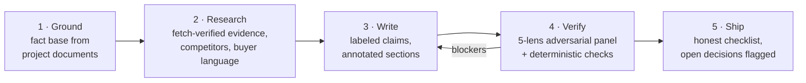

# evidence-based-copywriting

An [Agent Skill](https://agentskills.io/specification) that produces marketing copy where **every factual claim is traced to a fetched source or the project's own documents, labeled, and adversarially verified before it ships** — landing pages, product pages, launch emails, one-pagers, and search/social metadata.

Built for teams whose copy has to survive skeptical technical buyers, legal and compliance review, and diligence: the discipline it enforces is the same standard US regulators already apply to advertisers (FTC prior-substantiation doctrine, 16 CFR Parts 255/465), packaged as a working pipeline instead of a policy document.

## Why this exists

Testing capable AI writers on realistic briefs shows they no longer fail by inventing customer logos — they fail two subtler ways:

1. **Citation without verification** — real-sounding statistics with plausible URLs, written from memory, never fetched, sometimes shipped with a "verify before launch" note.
2. **Capability and terms fabrication** — invented product mechanisms, architecture details, and commercial terms ("rate locked for life") that no document establishes, because those *feel* like copywriting latitude rather than claims.

This skill exists to stop both, and to make the result auditable: the output is copy **plus** its fact base, per-section source annotations, flagged open decisions, and a falsifiable self-review checklist.

## The pipeline



## What's inside

All paths below live under `skills/evidence-based-copywriting/` (the repo is packaged as a Claude Code plugin that is also its own marketplace):

| Path | What it is |
|---|---|
| `SKILL.md` | The pipeline, Iron Laws, rationalization table, red flags |
| `references/evidence-standards.md` | Verification protocol, source hierarchy, the US legal floor (with primary citations), and an evidence-trap catalog from live adversarial reviews |
| `references/copy-craft.md` | Voice contract, research-grounded banned lexicon, hero specs and the five-second test, section architecture, stage-honesty proof playbook, metadata facts vs. folklore |
| `references/verification.md` | The five-reviewer adversarial panel, severity rubric, fix protocol |
| `references/enterprise-integration.md` | How the standard slots into claims registries, MLR/FINRA-style review gates, and brand-voice governance |
| `templates/fact-base-template.md` | Fill first — every product claim must trace to it |
| `templates/deliverable-template.md` | Write into — annotations, machine-checkable limits, checklist |
| `scripts/check_copy.py` | Deterministic checks: banned lexicon, embedded word/char limits, citation worksheet (stdlib Python, CI-friendly) |

## Install

**Claude Code — recommended (two commands, updates managed for you):**

```
/plugin marketplace add arome3/evidence-based-copywriting
/plugin install evidence-based-copywriting@evidence-based-copywriting
```

The skill then appears as `evidence-based-copywriting:evidence-based-copywriting` and triggers automatically on high-stakes copy work.

**Claude Code — manual (personal or per-project):**

```bash
git clone https://github.com/arome3/evidence-based-copywriting.git /tmp/ebc &&
cp -R /tmp/ebc/skills/evidence-based-copywriting ~/.claude/skills/
```

For one project, copy into `.claude/skills/` inside the repo and commit it.

**Claude.ai** (Pro/Max/Team/Enterprise, code execution enabled): download `evidence-based-copywriting-skill.zip` from the [latest release](https://github.com/arome3/evidence-based-copywriting/releases/latest) and upload via Settings → Features → Skills.

**Claude API**: upload the same release zip via the Skills API (`/v1/skills`, beta header `skills-2025-10-02`) with the code-execution tool enabled. Note the API sandbox has no network access, so the skill runs in its documented no-network fallback (claims are marked unverified rather than silently trusted).

Skills don't sync across surfaces — install where you work.

## Use

Ask for what you need in plain language — the skill triggers on high-stakes copy work:

> Write the landing page for [product] using our strategy docs in ./docs — follow the evidence-based-copywriting standard.

> Audit ./site/index.html against the evidence-based-copywriting skill and report every unsupported claim.

Standalone checks without an agent:

```bash
python3 skills/evidence-based-copywriting/scripts/check_copy.py your-copy.md          # lexicon + limits
python3 skills/evidence-based-copywriting/scripts/check_copy.py your-copy.md --urls   # citation worksheet
```

## What it is not

- **Not a brand voice guide.** It is a claims layer; it defers tone and terminology to your style guide and layers evidence discipline underneath.
- **Not legal advice.** It raises copy to the general FTC floor and produces reviewer-ready artifacts; regulated industries still route output through counsel and compliance.
- **Not a growth-hacking playbook.** It will refuse the tactics that work until the first skeptical reader checks one claim.

## License

MIT — see [LICENSE](LICENSE).
